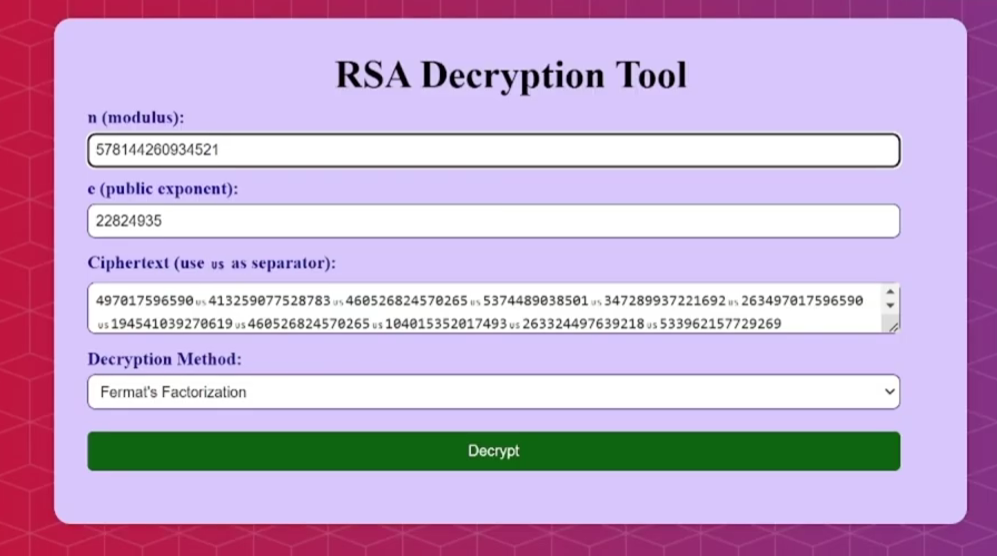
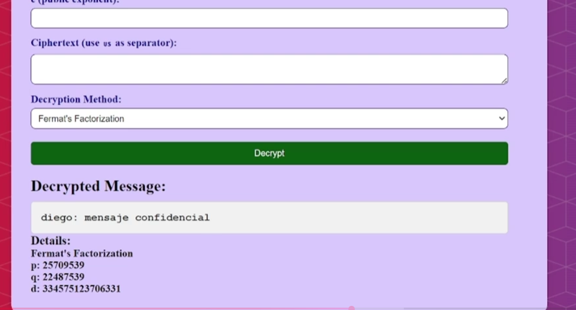

# DescifrarRSA 🔐

Herramienta educativa web para analizar vulnerabilidades en implementaciones 
débiles del algoritmo RSA, mediante técnicas de factorización del módulo `n`.

## 📌 Descripción

Este proyecto implementa y demuestra tres métodos clásicos de ataque a RSA 
cuando se utilizan claves con factores primos débiles o cercanos entre sí. 
Desarrollado como proyecto académico para comprender las condiciones bajo las 
cuales RSA puede ser comprometido y la importancia de generar claves seguras.

La aplicación recibe una clave pública `(n, e)` y un mensaje cifrado, 
factoriza `n` para obtener `p` y `q`, calcula la clave privada `d` y 
descifra el mensaje.

## ⚙️ Métodos de ataque implementados

| Método | Descripción | Condición de vulnerabilidad |
|--------|-------------|----------------------------|
| **Factorización de Fermat** | Explota la cercanía entre `p` y `q` | `p` y `q` son primos próximos entre sí |
| **Pollard's Rho** | Algoritmo probabilístico de factorización | Módulo `n` con factores pequeños o estructura débil |
| **Small Prime Factorization** | Criba de Eratóstenes + división por primos pequeños | Uno de los factores es un primo pequeño |

## 🛠️ Stack

- **Backend:** Python, Flask
- **Frontend:** HTML, CSS
- **Algoritmos:** implementados desde cero en `RSA.py` y `rsa_utils.py`

## 🚀 Cómo ejecutarlo
```bash
# 1. Clona el repositorio
git clone https://github.com/Diego-Alvarez19/DescifrarRSA.git
cd DescifrarRSA

# 2. Instala dependencias
pip install flask

# 3. Ejecuta la aplicación
python app.py
```

Abre tu navegador en `http://localhost:5000`

## 🧪 Cómo usarlo

1. Ingresa el módulo `n` y el exponente público `e` de la clave RSA
2. Pega el texto cifrado (usa `␟` como separador entre valores)
3. Selecciona el método de factorización
4. Haz clic en **Decrypt**

La herramienta mostrará el mensaje descifrado junto con los factores 
encontrados `p`, `q` y la clave privada calculada `d`.

## 📁 Estructura del proyecto
```
DescifrarRSA/
├── app.py              # Aplicación Flask y rutas
├── RSA.py              # Implementación base de RSA (encode/decode)
├── rsa_utils.py        # Algoritmos de factorización y descifrado
├── templates/
│   └── index.html      # Interfaz web
└── static/
    └── styles.css      # Estilos
```

## ⚠️ Aviso

Este proyecto es **exclusivamente educativo**. Su propósito es demostrar 
por qué la elección de parámetros débiles en RSA compromete la seguridad, 
y no debe utilizarse con fines maliciosos. RSA con claves de 2048+ bits 
y primos aleatorios fuertes no es vulnerable a estos métodos.

## 📚 Conceptos aplicados

- Algoritmo extendido de Euclides (cálculo de inverso modular)
- Exponenciación modular rápida
- Factorización de Fermat
- Algoritmo Rho de Pollard
- Criba de Eratóstenes

---

## 🖥️ Capturas de pantalla

**Ingreso de parámetros — clave pública `(n, e)` y mensaje cifrado:**



**Resultado — factores `p`, `q`, clave privada `d` y mensaje descifrado:**



---

## 🎥 Demostración con Wireshark

En el siguiente video se muestra el flujo completo del ataque:
captura de tráfico de red con **Wireshark** para interceptar los parámetros 
RSA (`n` y `e`) y el mensaje cifrado, seguido del proceso de descifrado 
con la herramienta.

[](https://www.youtube.com/watch?v=Qp9siFRAvuY)
